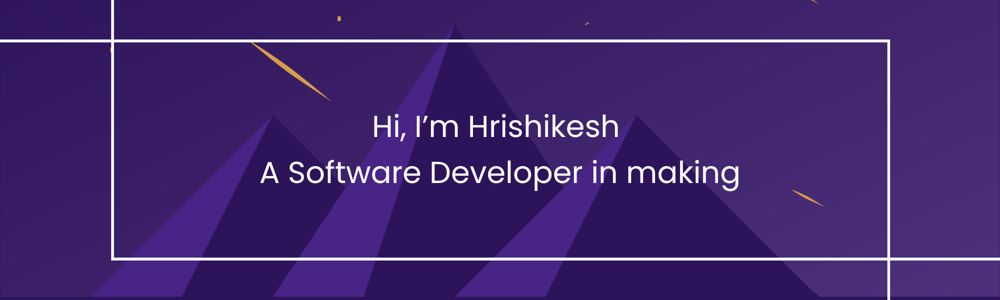

<!--Banner-->

<h3 align="center">A software developer fueled by passion and creativity</h3>

 

  

 
 🌱 I’m currently learning **PHP, CMS and Full-Stack Devleopment**
 
 🤝 Highly instrested for collaboration in **Full Stack development Projects**

💬 Ask me about **Frontend , React.js, Firebase... or anything [here](https://github.com/hrishi3007/hrishi3007/issues)**
 
📧 Reach me at **hrishikolte3@gmail.com**
 

 
 

 <h3 align="left">Connect with me:</h3>

 

 
<h2 align="centre">⚒️ Languages-Frameworks-Tools ⚒️</h2>
 

    
     

 

<h2 align="center">⚡ Stats ⚡</h2>
 
<!-- https://github-readme-streak-stats-salesp07.vercel.app?user=&theme=tokyonight)](https://git.io/streak-stats -->

  
<!--    -->
     
  

  

 

 
